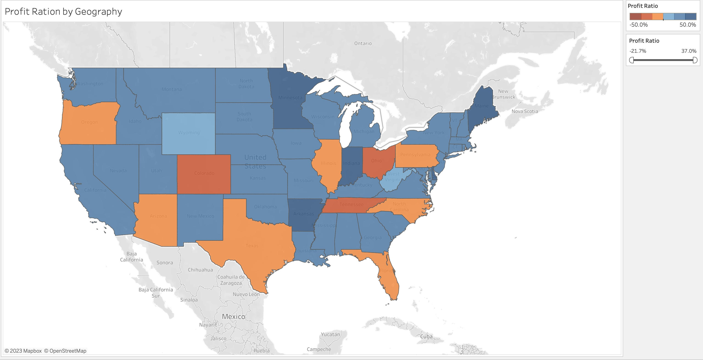
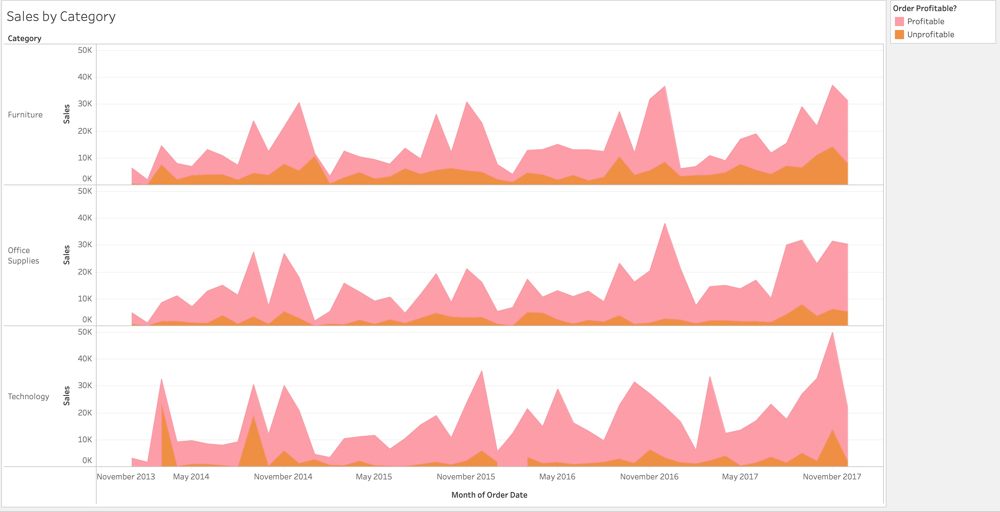
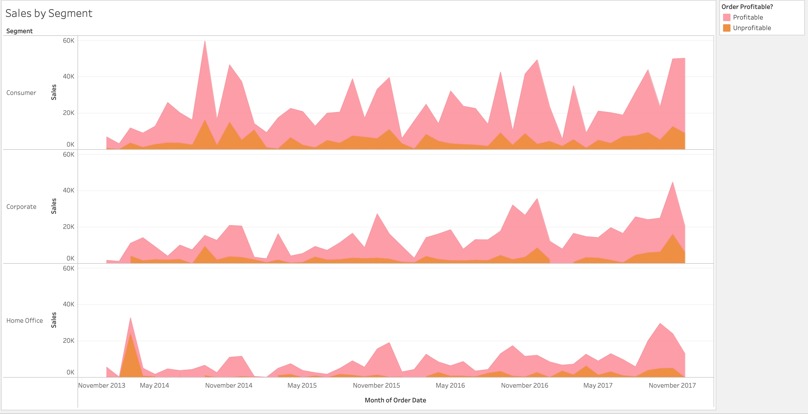

# TableauExample

Here I'm using an example dataset to try out different visualization methods using Tableau. 
The file:

  Executive overview.twbx

Contains the data and the tableau workbook (can also be read as XML) 

Here are some ways that the data can be summarized and visualized:

## Map Visualization

## Line Charts

## Table Visualization

